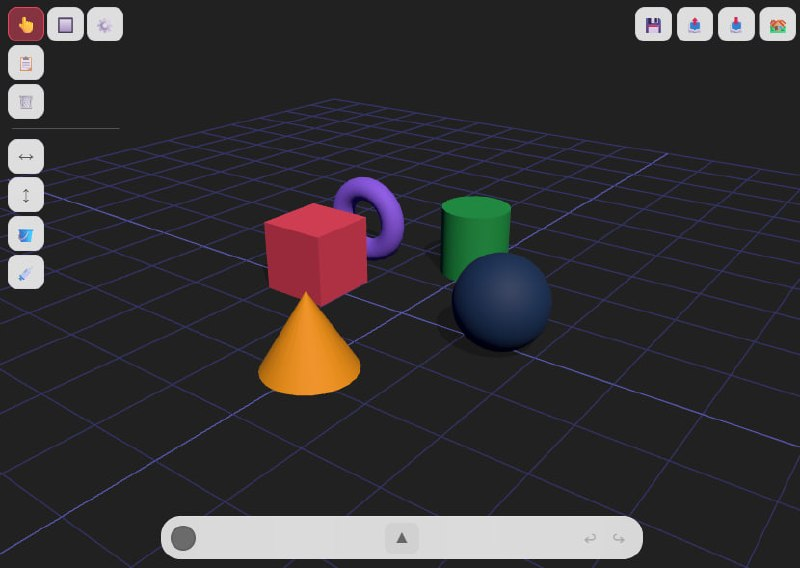

# 3D Primitive Builder

> A browser-based 3D scene editor — place, transform, and style 3D primitives in real time. Built with Three.js.



## ✨ Features

### 🧊 Primitives
**15 object types** — Box, Sphere, Cylinder, Cone, Torus, Half Donut, Quarter Donut, Half Ball, Quarter Ball, Bowl, Isosceles Triangle, Right Triangle, Plane, Image, Bookshelf

### 🎮 Gizmo Transforms
- **Two gizmo modes** — Simple (single cube) and Advanced (per-axis arrows + rings)
- **Move / Rotate / Scale** with direct axis manipulation
- **Long axis lines** during drag for precise alignment
- **Rotation pie indicator** — only active ring visible, shows rotation arc
- **Multi-select transforms** — translate, rotate, scale groups of objects
- **Ctrl/Cmd+Snap** — hold Ctrl while dragging for stepped increments

### 🖱️ Placement
- **Click-to-place** — select a primitive, see a ghost preview follow the mouse, click to place on any surface
- **Surface-aware** — objects snap to surface normals (sits on sloped surfaces)
- **Auto height** — placement offset computed from actual geometry bounds

### 🎨 Color System
- **Custom color picker** — vanilla-picker HSV popup, positioned above the toolbar
- **Color sync with selection** — bar-color dot shows selected object's color, changing it applies to selection
- **Recent colors** — last 5 colors tracked automatically
- **Swatches** — 8 default + custom swatches with edit mode (long-press to reorder/delete)
- **Paint bucket** 🪣 — tap objects to recolor
- **Eyedropper** 💉 — tap objects to pick color, auto-returns to select mode
- **Icons update** with current color preview

### 🛠️ Editing Tools
- **Flip Horizontal/Vertical** — multiply scale by -1 with undo
- **Duplicate** — clone selected with offset
- **Delete** — Backspace/Delete
- **Rectangle Select** — drag a rectangle in the viewport
- **Undo/Redo** — Cmd+Z, Cmd+Y
- **Info panel** — editable name, position (X/Y/Z), scale (X/Y/Z) with scrubbers

### 🌍 World Controls
- **Directional sun** — adjustable azimuth & elevation sliders
- **Ambient light** — toggle + color
- **Background color** — scene background picker
- **Grid** — toggle, color, opacity controls
- **Soft shadows** — toggleable shadow map (PCFSoft)
- **SSAO** — screen-space ambient occlusion (toggleable)

### 🖥️ UI
- **Glass panel** — translucent backdrop-blur UI, collapsible bottom panel with 5 tabs (Objects, Tools, Color, Info, World)
- **Gizmo toggle popup** — gear icon switch between Simple/Advanced gizmo, Click/Rect select
- **Mobile-friendly** — bigger touch targets (44px min-height), responsive layout, panel collapse toggle
- **Keyboard shortcuts** — intuitive controls throughout

### 💾 Save / Load
- **Save scenes** to localStorage with thumbnails
- **Save As / Overwrite** — name and update existing saves
- **Export/Import** — scene data as JSON files
- **Sample projects** — built-in samples: Rumah, Gedung, Gunung, Bunga, Rak Buku

## 🚀 Quick Start

```bash
# Using Vite dev server
npm install
npm run dev
# Opens at http://localhost:5173
```

Or just open `index.html` directly in any modern browser (no build step needed).

## 🧰 Tech Stack

- **Three.js** (r157) — WebGL rendering, scene graph, raycasting
- **Three.js examples** — OrbitControls, EffectComposer, SSAOPass
- **vanilla-picker** — Color picker popup
- **Vanilla HTML/CSS/JS** — no framework, no backend

## 📸 Screenshots

| Feature | Preview |
|---------|---------|
| Scene Editor | `screenshots/editor.png` |
| Color Picker | `screenshots/color-picker.png` |
| Advanced Gizmo | `screenshots/advanced-gizmo.png` |
| Sample Scenes | `screenshots/samples.png` |

> ℹ️ Screenshots live in the `screenshots/` directory. Take your own by loading the app and using your browser's screenshot tool!

## 📄 License

MIT
